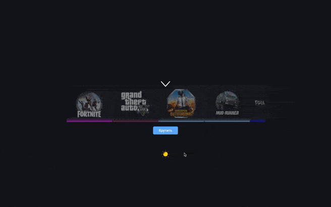

# PWA приложение «Random Game»

[**Random Game**](https://roulette-chi-seven.vercel.app/) — это прогрессивное веб-приложение, созданное для тех, кто испытывает трудности с выбором игры из своей обширной коллекции. Это приложение в стиле рулетки добавляет элемент неожиданности и справедливости в процесс выбора игры, делая его веселым и легким.

## Особенности:

- **Настройка шансов**: Настройте вероятность выбора каждой игры, чтобы адаптировать приложение под свои предпочтения.
- **Визуальный индикатор редкости**: Легко увидеть редкость вероятности выбора игры по цветовой кодировке в нижней части каждой ячейки.
- **Светлая и темная тема**: Выберите между светлой и темной темой интерфейса приложения для комфортного просмотра в любое время суток.
- **Кроссплатформенность**: Наслаждайтесь использованием приложения на десктопных и мобильных устройствах.
- **Возможность скачать на телефон**: Скачайте приложение на свой телефон для быстрого и легкого доступа.

## Предстоящие улучшения:

- **Выбор игр пользователем**: В скором времени вы сможете выбирать, какие игры добавлять или удалять из рулетки.
- **Переключение шансов на определенные игры**: Получите возможность включать или отключать шансы выбора определенных игр.
- **Регулировка звука щелчка**: Доработка щелчка при вражении рулетки.

## Начало работы:

Чтобы начать использовать **Random Game**, просто посетите [веб-сайт](https://roulette-chi-seven.vercel.app/) и следуйте инструкциям по установке для вашего устройства. Приложение разработано так, чтобы быть интуитивно понятным и удобным в использовании.

## Поддержка:

Если вы столкнулись с какими-либо проблемами или у вас есть предложения по улучшению, не стесняйтесь обращаться ко мне.

Присоединяйтесь к нам, чтобы сделать выбор игры веселой и легкой частью вашего игрового ритуала с **Random Game**!
